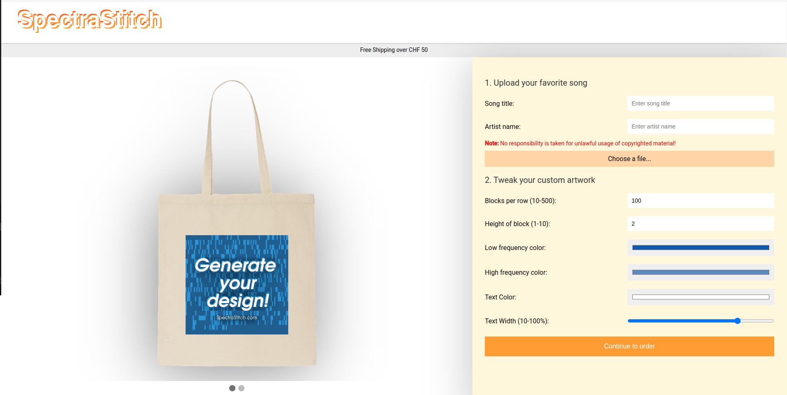
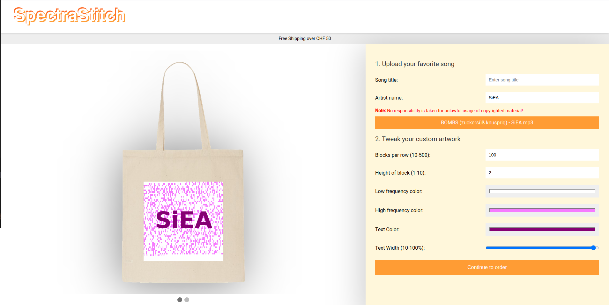
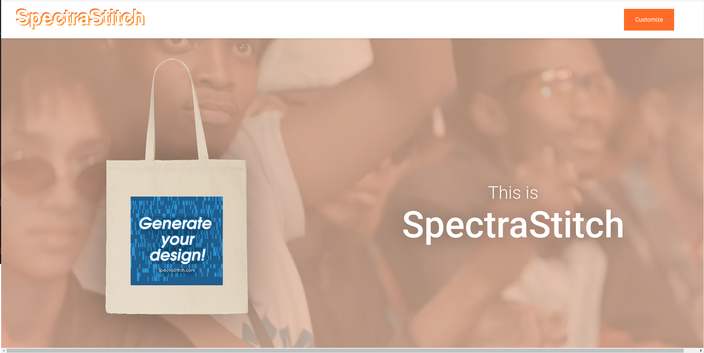
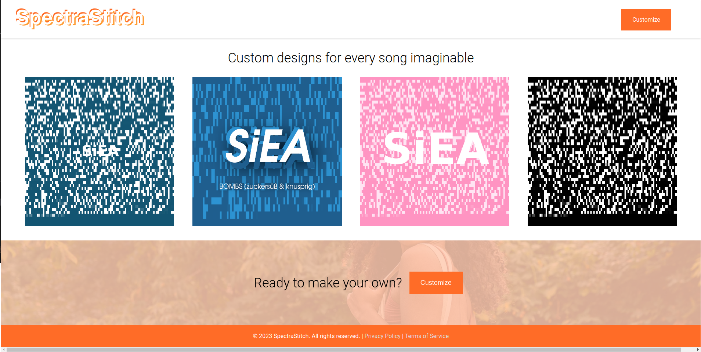

# SpectraStitch

SpectraStitch is a Flask web application that processes audio files and generates a visual representation based on the Discrete Fourier Transform (DFT) of audio slices. The visualization reflects frequency distribution and can be customized in terms of dimensions, color gradient, and more. Additionally, the artist names and song titles can be overlayed onto the generated image.

## Features
### Back-end:
- **Audio Processing**: Uses the `librosa` library to load audio files and compute their spectrogram using `np.fft`.
- **Graphics generation**: Uses `matplotlib` to generate an image from the generated DFT slices. Additionally overlays image with custom text.
### Front-end:
- **Upload portal**: Allows uploading of custom music with a modern layout.
- **Responsive Design**: The frontend supports tweaking of the graphical output by re-running the Python back-end code.

## Installation & Setup
To run the Flask app and have a local preview of the project:
1. Clone the repository:
`git clone https://github.com/lionnus/SpectraStitch`
2. Navigate to the project directory:
`cd SpectraStitch/webapp`
3. Install the necessary dependencies:
`pip install flask librosa numpy matplotlib`
4. Run the application to start the local server:
`python app.py`

## Usage
1. Start the server and navigate to http://localhost:5000 in your browser.
2. Upload an audio file.
4. View the generated image and tweak the parameters with a real-time preview.